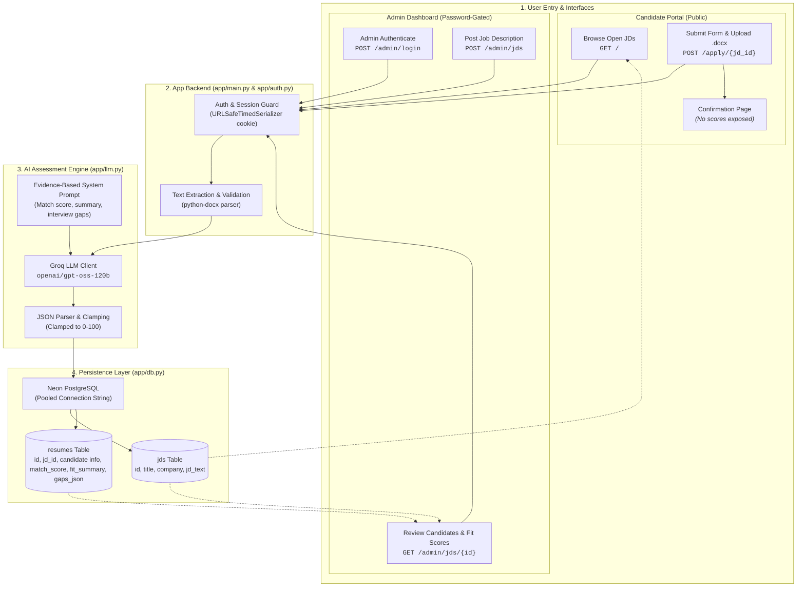

# Resume Screener

A small hiring tool: admins post job descriptions and see LLM-scored applications
against each one; candidates browse open roles and apply with a `.docx` resume, and
only ever see a confirmation.

- **Admin** (`/admin`, password-gated) — post JDs, see every application per JD with
  match score, fit summary, and gaps/follow-up questions.
- **Candidate** (`/`, public) — open roles, application form, `.docx` upload,
  confirmation. No scores anywhere.

**Stack:** FastAPI + Jinja2 · Neon (Postgres) · Groq `openai/gpt-oss-120b` · Vercel.

## System Architecture & Block Workflow



See [SHORTWRITEUP.md](SHORTWRITEUP.md) for approach and trade-offs.

## Local development

```bash
python -m venv .venv && .venv/Scripts/activate      # Windows; use bin/activate on macOS/Linux
pip install -r requirements.txt
cp .env.example .env                                 # then fill in the values
python scripts/init_db.py                            # create tables
uvicorn app.main:app --reload --port 8000
```

Local and production both talk to Neon. Use a Neon branch for development if you
want to experiment without touching production data.

## Environment variables

| Variable | Purpose |
|---|---|
| `GROQ_API_KEY` | Groq API key for resume scoring |
| `ADMIN_PASSWORD` | Password for the admin login |
| `SECRET_KEY` | Signs the admin session cookie — must stay stable across deploys |
| `DATABASE_URL` | Neon connection string — use the **pooled** one (host contains `-pooler`) |

## Deploying

1. Create a project at [neon.tech](https://neon.tech) and copy the pooled connection string.
2. Put it in `.env` as `DATABASE_URL` and run `python scripts/init_db.py` once to create the schema.
3. `vercel` to link the project, set the four variables above in the Vercel dashboard
   (or via `vercel env add`), then `vercel --prod`.

Vercel detects the FastAPI app in `app/main.py` natively and serves every route
from it — no `vercel.json` or `api/` shim is needed.
